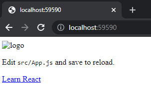
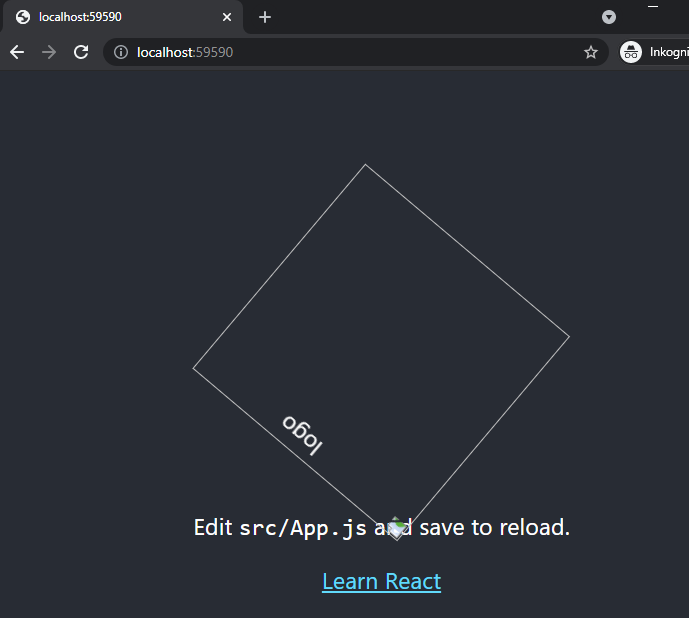
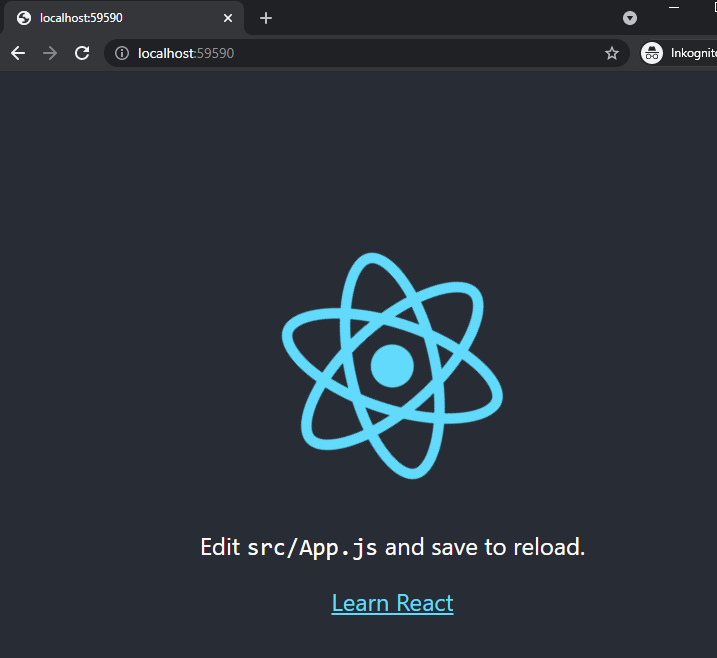

> There are some base features in the project [lorem_headless](https://github.com/loremipsumdonec/optimizely-cms-models/tree/master/posts/lets_play_around_with_headless/example/lorem_headless), and I will not go into depth for these. The project has extended the routing so that it is possible to write http://localhost:59590/index.json to get the content in json. 
>
> The project also uses an `IFilterProvider` to be able to add filters in a request based on some business logic. Which in this case checks if the controller is a `IWebController`.
>
> The project will also use [JSPool](https://github.com/Daniel15/JSPool) to handle multiple JavaScript engines
>

For it to be possible to render, the output from the frontend projects needs to be available in the Optimizely CMS project. You can, for example, take the entire build directory and place it under Assets. If you want to have several different frontend projects in the same Optimizely CMS project, you need to place the frontend projects in separate catalogs.

> I usually work with the frontend project being in a separate repository and when the frontend team then makes a release, it will trigger a pipeline/workflow that automatically builds and commits the output in the repository where Optimizely CMS is located, it also creates a pull/merge request.

## Configuration

For each frontend project that should be used in the Optimizely CMS will need a separate configuration, and a good place for this is in a `IInitializableModule`.

I the example below you can see that we load the _server.js_ file and add the wrapper function, see [CreateReactAppInitialization.cs](https://github.com/loremipsumdonec/optimizely-cms-models/blob/master/posts/lets_play_around_with_headless/example/lorem_headless/lorem_headless/Features/CreateReactApp/Initialization/CreateReactAppInitialization.cs)

> `IJavaScriptManager` is a service that owns the configuration for each engine, and you can find the code [here](https://github.com/loremipsumdonec/optimizely-cms-models/blob/master/posts/lets_play_around_with_headless/example/lorem_headless/lorem_headless/Features/Render/Services/DefaultJavaScriptManager.cs).

```csharp

public void Initialize(InitializationEngine context)
{
    if(context.HostType == HostType.TestFramework) 
    {
        return;
    }

    var manager = context.Locate.Advanced.GetInstance<IJavaScriptManager>();
    manager.Register("create-react-app", new JsPoolConfig()
    {   
        MaxEngines = 2,
        StartEngines = 0,
        Initializer = (e) => {

            e.ExecuteFile(
                HttpContext.Current.Server.MapPath("~/Assets/create-react-app/server/server.js"), Encoding.UTF8
            );

            e.Execute("function render() { return lorem.render() }");
        }
    });
}

```

## First render

Now it’s time to add a render function in the ASP.NET MVC pipeline. A good candidate for this could be an `IViewEngine` which we add in the view engine collection `ViewEngines.Engines`. Another alternative is to create an `ActionResult`, much like `JsonResult`, and this is my preference.

With the help from `IActionFilter` we can change the `ActionResult` after the controller. This will make it possible to have the same structure in the controllers, and we do not need to think so much about how the data will be presented at that point.

> I use `ActionResult` when I need to do some type of transformation, for example transforming a `CalendarEventPage` to [ical](https://en.wikipedia.org/wiki/ICalendar) format or a SiteMapPage to xml or html. Usually, you can use the same controller and model, but there will be cases when you will need a different controller.

We will need a separate `IActionFilter` for each frontend project, this will make it simpler to manage specific logic for each frontend project, see [CreateReactAppActionFilter.cs](https://github.com/loremipsumdonec/optimizely-cms-models/blob/master/posts/lets_play_around_with_headless/example/lorem_headless/lorem_headless/Features/CreateReactApp/CreateReactAppActionFilter.cs).

> In the example project I have also created a separate `ActionResult` for each frontend project, this is only to minimize the complexity and make the examples easier to understand. In a _real world_, you will only need one `ActionResult`.

```csharp
public class CreateReactAppActionResult
    : ActionResult
{
	private readonly IJavaScriptManager _manager;

    ...

	public override void ExecuteResult(ControllerContext context)
    {
        HttpContextBase contextBase = context.HttpContext;
        contextBase.Response.ContentType = "text/html";

        using (var engine = _manager.GetEngine("create-react-app"))
        {
       		string html = engine.CallFunction<string>("render");

            using (var writer = new StreamWriter(context.HttpContext.Response.OutputStream, Encoding.UTF8))
         	{
    	        writer.Write(html);
	        }
    	}
	}
}
```

There is no major difference to what the code looked like in the test cases we started with, see the complete example [here](https://github.com/loremipsumdonec/optimizely-cms-models/blob/master/posts/lets_play_around_with_headless/example/lorem_headless/lorem_headless/Features/CreateReactApp/CreateReactAppActionResult.cs)

## Something is missing

It's quite obvious that something is missing when we run the first server-side rendering. We get HTML but nothing else, such as styles or images.



All files that we need to use are in the assets-manifest.json file, entrypoints property.

```json
{
  "files": {
  	...
  },
  "entrypoints": [
    "static/js/runtime-main.3f2b3cb3.js",
    "static/js/2.d84eab10.chunk.js",
    "static/css/main.a617e044.chunk.css",
    "static/js/main.3bd4fa35.chunk.js"
  ]
}
```

Who should have the responsibility so that these will be included in the final HTML? In my world it is obvious, it is the frontend project as it is responsible for the HTML. But the problem is that the files are generated during the build step and with a hash, which is to avoid cache problems for the client.

This makes it difficult to link these in the frontend before *build*, so we need to make this as an input to the render method. We will also need rewrite the paths, because the real location of the files in Optimizely CMS the project differs from the frontend project.

### Load entry points

We need to load the _assets-manifest.json_ file and get the values in `entrypoints` and then put in the correct path. We can then send this as an array to the frontend, which can then embed these in their HTML.

```csharp
public class CreateReactAppWithHtmlInitialization
        : IInitializableModule
{
        public void Initialize(InitializationEngine context)
        {
            if(context.HostType == HostType.TestFramework) 
            {
                return;
            }

            var entrypoints = $"[{string.Join(",", GetEntryPoints())}]";

            var manager = context.Locate.Advanced.GetInstance<IJavaScriptManager>();
            manager.Register("create-react-app-with-html", new JsPoolConfig()
            {   
                MaxEngines = 2,
                StartEngines = 0,
                Initializer = (e) => {

                    e.ExecuteFile(
                        HttpContext.Current.Server.MapPath("~/Assets/create-react-app-with-html/server/server.js"), Encoding.UTF8
                    );

                    e.Execute($"function render() {{ return lorem.render({entrypoints}) }}");
                }
            });
        }

        private IEnumerable<string> GetEntryPoints() 
        {
            string content = File.ReadAllText(HttpContext.Current.Server.MapPath("~/Assets/create-react-app-with-html/asset-manifest.json"));
            var manifest = JsonConvert.DeserializeObject<JObject>(content);

            return manifest.SelectTokens("$.entrypoints[*]").Values<string>()
                .Select(v => "'" + "/Assets/create-react-app-with-html/" + v + "'");
        }
}
```

In addition, we also need to update the render function in _server.js_ which is in the frontend project, it needs to take `entrypoints` as input and return a valid HTML.

```javascript
export const render = (entrypoints) => {
	
	var files = [];

	for (const entrypoint of entrypoints) {
		if(entrypoint.endsWith('.css')) {
			files.push(`<link rel="stylesheet" href="${entrypoint}">`)
			continue;
		}

		files.push(`<script src="${entrypoint}"></script>`)
	}

	return ` 
	<html>
		<head>
			${files.join('\n')}
		</head>
		<body>
			${ReactDOMServer.renderToStaticMarkup(React.createElement(Application))}
		</body>
	</html>`
}
```

If we now rebuild the frontend project with both `npm run build` and `npm run build:server` and move the output to the Optimizely CMS project.

> Do not forget to copy the files between each build, and only take server.js from npm run build: server.



When we then start the project, we will be met by the following page, where everything works except that the image is not loaded. The problem is that we cannot rewrite that path for the image. 

It is important that it works properly in the development environment for the frontend. The solution is to put the files in the same place in the Optimizely CMS project as in the frontend project.

```javascript
import logo from './logo-unique.svg';
import './App.css';

function App() {
  return (
    <div className="App">
      <header className="App-header">
        
        <p>
          Edit <code>src/App.js</code> and save to reload.
        </p>
        <a
          className="App-link"
          href="https://reactjs.org"
          target="_blank"
          rel="noopener noreferrer"
        >
          Learn React
        </a>
      </header>
    </div>
  );
}
```

> Like everything, there are several solutions to the problem, here I take a simpler solution. It is rare to have problems with several frontend projects having conflict with the files. But when it happens, you simply must change the name so that it becomes unique.



## Conclusion

We have now succeeded in server-side rendering the React application in Optimizely CMS and we have a good foundation to continue working with. In the next part, we will focus on using view models and build a slightly more classic application, which has a navigation and some other functions.