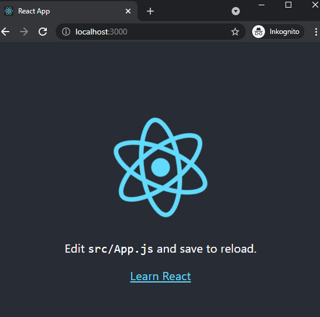

> All .NET examples will be from test cases that I have created in the example project [lorem_headless](https://github.com/loremipsumdonec/optimizely-cms-models/tree/master/posts/lets_play_around_with_headless/example/lorem_headless) and from file [CreateReactAppTests.cs](https://github.com/loremipsumdonec/optimizely-cms-models/blob/master/posts/lets_play_around_with_headless/example/lorem_headless/lorem_headless_tests/CreateReactAppTests.cs), and the examples for React will be from the project [lorem_headless_react](https://github.com/loremipsumdonec/optimizely-cms-models/blob/master/posts/lets_play_around_with_headless/example/lorem_headless_react)

## Create a React project

Now that we are going to use React, we also want to stick to the development tools and principles used in that "environment", this is for several reasons, but the main one is that it should be easy to find help and documentation.

To create a React project we can start with following the introduction [Create a New React App](https://reactjs.org/docs/create-a-new-react-app.html) this will give us a base to start from.



When you have create a React project from `create-react-app` you should have something as the above.

## Explore the output

The first thing we will examine is the type of output generated when we build the project with `npm run build`. This command will trigger a build and create directory that contains a set of different files, several are JavaScript with varying names.

The most important file for now is _asset-manifest.json_. This file contains all the information we need to continue, below is an example.

```json
{
  "files": {
    "main.css": "/static/css/main.a617e044.chunk.css",
    "main.js": "/static/js/main.3bd4fa35.chunk.js",
    "main.js.map": "/static/js/main.3bd4fa35.chunk.js.map",
    "runtime-main.js": "/static/js/runtime-main.3f2b3cb3.js",
    "runtime-main.js.map": "/static/js/runtime-main.3f2b3cb3.js.map",
    "static/js/2.d84eab10.chunk.js": "/static/js/2.d84eab10.chunk.js",
    "static/js/2.d84eab10.chunk.js.map": "/static/js/2.d84eab10.chunk.js.map",
    "static/js/3.36aa79dd.chunk.js": "/static/js/3.36aa79dd.chunk.js",
    "static/js/3.36aa79dd.chunk.js.map": "/static/js/3.36aa79dd.chunk.js.map",
    "index.html": "/index.html",
    "static/css/main.a617e044.chunk.css.map": "/static/css/main.a617e044.chunk.css.map",
    "static/js/2.d84eab10.chunk.js.LICENSE.txt": "/static/js/2.d84eab10.chunk.js.LICENSE.txt",
    "static/media/logo.6ce24c58.svg": "/static/media/logo.6ce24c58.svg"
  },
  "entrypoints": [
    "static/js/runtime-main.3f2b3cb3.js",
    "static/js/2.d84eab10.chunk.js",
    "static/css/main.a617e044.chunk.css",
    "static/js/main.3bd4fa35.chunk.js"
  ]
}
```

It is mainly the property `entrypoints` that we are interested in as it contains the files needed run the React application. But if we try to load these into the JavaScript engine, we will have get an exception `ReferenceError: document is not defined`. The keyword is _document_. 

```csharp
[Fact]
public void LoadEntryPoints_ShouldThrowException()
{
    var entrypoints = GetEntryPoints("CreateReactApp");
    var engine = new V8JsEngine();

    var exception = Assert.Throws<JsRuntimeException>(() =>
    {
        foreach (var file in entrypoints)
        {
        	engine.ExecuteFile(file);
        }
    });

    Assert.StartsWith("ReferenceError: document is not defined", exception.Message);
}
```

The reason for this error message is that we try to run this outside of a browser and do not have access to either _document_ or _window_. The files in the `entrypoints` property are for a browser and not for server-side rendering, which you might have thought of if you saw the _css_ file.

> You can see this as a first rule when it comes to server-side rendering, never use document or window in code that runs on the server.

There are several other frontend technologies that can be used that do not work when doing server-side rendering.
Which means that you usually need to build the project in two variants, one for the browser and the other for the server.

## Build for server

The first thing we can do is add an entry point to the application that can be used for server-side rendering, similar to _index.js_ which is for the browser. Create a new file called _server.js_ with the following content, see this file for an example [server.js](https://github.com/loremipsumdonec/optimizely-cms-models/tree/master/posts/lets_play_around_with_headless/example/lorem_headless/lorem_headless_react/src/server.js)

```javascript
import React from 'react';
import ReactDOMServer from 'react-dom/server';
import Application from './App';

export const render = () => {
	var element = React.createElement(Application);
	return ReactDOMServer.renderToStaticMarkup(element);
}
```

Another difference when rendering on the server is that you should use `ReactDOMServer.renderToString` or ` ReactDOMServer.renderToStaticMarkup` depending on whether you are going to start the application on the client such as a single-page application or if should _just_ be HTML , you can find more information about this [here](https://reactjs.org/docs/react-dom-server.html).

But it is not enough to add a new file to the project, we also need to change the build configuration. Which brings us to the second problem. 

There is no standard to change the configuration in a `create-react-app` for how the project is to be built. Here we need to make a small sidestep from the standard to be able to move forward. 

One alternative is to use the `eject` function in `create-react-app`, then we will get access to everything and be able to configure it exactly how we want. But this path will also add more complexity to the project. 

The second alternative is to use tools like [CRACO](https://github.com/gsoft-inc/craco) or [react-app-rewired](https://github.com/timarney/react-app-rewired) which will give us access to the configuration for `create-react-app` so we can override some changes. 

### Configure

Install CRACO by following the [installation guide](https://github.com/gsoft-inc/craco/blob/master/packages/craco/README.md#installation), you will also need to install `cross-env` with `npm install cross-env --save-dev`.  

The next step is to add a script in the [_package.json_](https://github.com/loremipsumdonec/optimizely-cms-models/tree/master/posts/lets_play_around_with_headless/example/lorem_headless_react/package.json) for building with the _server.js_ as entry point, and in the _craco.config.js_ we can add the following code, see the [craco.config.js](https://github.com/loremipsumdonec/optimizely-cms-models/tree/master/posts/lets_play_around_with_headless/example/lorem_headless_react/craco.config.js). 

> Besides setting the entry to _server.js_ we will also need to change some other configuration, like specifying a library. 

```javascript
const serverSettings = {
    devtool: 'none',
    entry: './src/server.js',
    output: {
        filename: 'server/server.js',
        library: 'lorem',
        publicPath: '/',
        devtoolNamespace: ''
    },
    optimization: {
        runtimeChunk: false
    }
}

module.exports = {
    webpack: {
       
        configure: (config, { env, paths }) => {

            if(process.env.BUILD_MODE === 'server') {

                console.log('building for server');

                let modified = Object.assign({}, config);
                delete modified.entry;
                delete modified.optimization.splitChunks;
    
                _.merge(modified, serverSettings);
    
                return modified;
            }

            return config;
        }
    }
}
```

> If you want to learn more about the configuration for `create-react-app`, you can find the source code [here](https://github.com/facebook/create-react-app/blob/main/packages/react-scripts/config/webpack.config.js#L188), and the documentation for `entry` in the `webpack` can be found [here](https://webpack.js.org/concepts/entry-points/).

When we run the new build script `npm run build:server` we will get a JavaScript built for the server at the location _build/server/server.js_ which can be used to run the React Application.

### Run the server.js

If we try to run the built _server.js_ file we will get another error, but this time it's a `ArgumentException` from JavaScript engine. This is because the JavaScript engine does not support functions calls like `lorem.render`.

```csharp
[Fact]
public void LoadServer_ThrowsArgumentException() 
{
    var engine = new V8JsEngine();
    string server = Resources.GetFile("CreateReactApp/server/server.js");

    engine.ExecuteFile(server);

    Assert.Throws<ArgumentException>(
        () => engine.CallFunction<string>("lorem.render")
    );
}
```

We can go around this problem by using a wrapper for the function `lorem.render`.

```csharp
[Fact]
public async void LoadServer_WithWrapper_RenderAppAndLinkHasExpectedText()
{
    var engine = new V8JsEngine();
    string server = Resources.GetFile("CreateReactApp/server/server.js");

    engine.ExecuteFile(server);
    engine.Execute("function render() { return lorem.render(); }");

    var html = engine.CallFunction<string>("render");

    Assert.Equal("Learn React", await html.GetTextAsync("a"));
}
```

## Conclusion

We have now managed to build `create-react app` with support for server-side rendering and can call the rendering from .NET.

