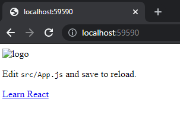
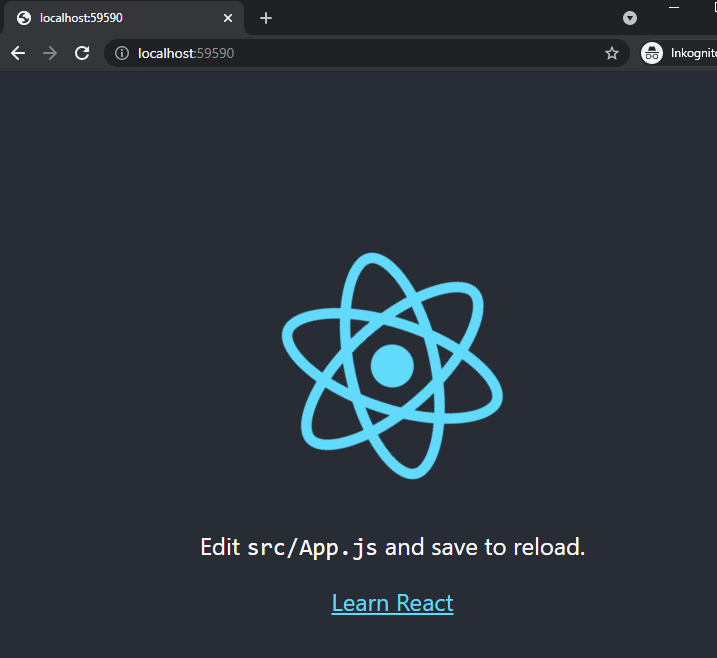

For it to be possible to render, the output from the frontend projects needs to be available in the Optimizely CMS project. You can, for example, take the entire build directory and place it under Assets. If you want to have several different frontend projects in the same Optimizely CMS project, you need to place the frontend projects in separate catalogs.

If you are going to build a single page application, you need to build the frontend project both for the client and server, and then add the file that should be for server-side rendering in the directory that contains the files for the client.

How the output then becomes available for Optimizely CMS is entirely up to the workflow that the teams in the project want to use.

> I usually work with the frontend project being in a own repository and when the frontend team then makes a release, it will trigger a pipeline/workflow that automatically builds and commits the output in the repository where Optimizely CMS is located, it also creates a pull/merge request.

## Configuration

For each frontend project that should be used in the Optimizely CMS will need a separate configuration, and a good place for this is in a IInitializableModule.

I the example below you can see that we load the _server.js_ file and add the wrapper function, see CreateReactAppInitialization.cs

> `IJavaScriptManager` is a service that owns the configuration for each engine, and you can find the code [here]().

```csharp

public void Initialize(InitializationEngine context)
{
    if(context.HostType == HostType.TestFramework) 
    {
        return;
    }

    var manager = context.Locate.Advanced.GetInstance<IJavaScriptManager>();
    manager.Register("create-react-app", new JsPoolConfig()
    {   
        MaxEngines = 2,
        StartEngines = 0,
        Initializer = (e) => {

            e.ExecuteFile(
                HttpContext.Current.Server.MapPath("~/Assets/create-react-app/server/server.js"), Encoding.UTF8
            );

            e.Execute("function render() { return lorem.render() }");
        }
    });
}

```

## First render

Now it’s time to add a render function in the ASP.NET MVC pipeline. A good candidate for this could be an `IViewEngine` which we add in the view engine registry `ViewEngines.Engines`. Another alternative is to create a `ActionResult`, much like `JsonResult`, and this is my personal preference.

In the previous chapter I said _Backend should be able to work in the same way, regardless of whether it is Razor view or React._ If we should create for example a `JavaScriptResult` then that could have some effect in the page controller. 

With the power of `IActionFilter` we can change the `ActionResult` after the controller has returned the model, see [TransformModelToJson.cs]() which will transform the view-model to _json_ if content type is `application/json`. We can do the same with this, but instead we will use an JavaScript engine to do the transformation.

> I use `ActionResult` when I need to do some type of transformation, for example transforming a `CalendarEventPage` to [ical](https://en.wikipedia.org/wiki/ICalendar) format or a SiteMapPage to xml or html. Usually, you can use the same model, but there will be cases when you will need a different controller depending on the format.

The only difference is that we will need a separate `IActionFilter` for each frontend project, this will make it a lot simpler to manage specific logic for each frontend project, see [TransformModelWithCreateReactApp.cs]().

> In the example project I have also created a separate `ActionResult` for each frontend project, this is only to minimize the complexity and make the examples easier to understand. In a _real world_, you will only need one `ActionResult`.

```csharp
public class CreateReactAppActionResult
    : ActionResult
{
	private readonly IJavaScriptManager _manager;

    ...

	public override void ExecuteResult(ControllerContext context)
    {
        HttpContextBase contextBase = context.HttpContext;
        contextBase.Response.ContentType = "text/html";

        using (var engine = _manager.GetEngine("create-react-app"))
        {
       		string html = engine.CallFunction<string>("render");

            using (var writer = new StreamWriter(context.HttpContext.Response.OutputStream, Encoding.UTF8))
         	{
    	        writer.Write(html);
	        }
    	}
	}
}
```

There is no major difference to what the code looked like in the test cases we started with.

## Something is missing

We will realize quickly that something is missing when we run the first server-side rendering. We get HTML but nothing else such as styles or images.



All files that we need to use are in the assets-manifest.json file, entrypoints property.

```json
{
  "files": {
  	...
  },
  "entrypoints": [
    "static/js/runtime-main.3f2b3cb3.js",
    "static/js/2.d84eab10.chunk.js",
    "static/css/main.a617e044.chunk.css",
    "static/js/main.3bd4fa35.chunk.js"
  ]
}
```

Now the only question is who will be responsible for these? In my world it is obvious, it is the frontend project as it is responsible for the HTML. But the problem is that the files are generated during the build step and with a hash, which is to avoid cache problems for the client.

Which makes it difficult to link these in the frontend, so we need to make this as an input to the render method. We will also need rewrite the paths, because of the real location of the files in Optimizely CMS the project.

### Load entry points

What is needed is that we load _assets-manifest.json_ and get the values in `entrypoints` and then put add the correct path. We can then send this as an array to the frontend, which can then embed these in their HTML.

```csharp
public class CreateReactAppWithHtmlInitialization
        : IInitializableModule
{
        public void Initialize(InitializationEngine context)
        {
            if(context.HostType == HostType.TestFramework) 
            {
                return;
            }

            var entrypoints = $"[{string.Join(",", GetEntryPoints())}]";

            var manager = context.Locate.Advanced.GetInstance<IJavaScriptManager>();
            manager.Register("create-react-app-with-html", new JsPoolConfig()
            {   
                MaxEngines = 2,
                StartEngines = 0,
                Initializer = (e) => {

                    e.ExecuteFile(
                        HttpContext.Current.Server.MapPath("~/Assets/create-react-app-with-html/server/server.js"), Encoding.UTF8
                    );

                    e.Execute($"function render() {{ return lorem.render({entrypoints}) }}");
                }
            });
        }

        private IEnumerable<string> GetEntryPoints() 
        {
            string content = File.ReadAllText(HttpContext.Current.Server.MapPath("~/Assets/create-react-app-with-html/asset-manifest.json"));
            var manifest = JsonConvert.DeserializeObject<JObject>(content);

            return manifest.SelectTokens("$.entrypoints[*]").Values<string>()
                .Select(v => "'" + "/Assets/create-react-app-with-html/" + v + "'");
        }
}
```

In addition, we also need to update the render function in _server.js_ which is in the frontend project, it needs to take `entrypoints` as input and return a valid HTML.

```javascript
export const render = (entrypoints) => {
	
	var files = [];

	for (const entrypoint of entrypoints) {
		if(entrypoint.endsWith('.css')) {
			files.push(`<link rel="stylesheet" href="${entrypoint}">`)
			continue;
		}

		files.push(`<script src="${entrypoint}"></script>`)
	}

	return ` 
	<html>
		<head>
			${files.join('\n')}
		</head>
		<body>
			${ReactDOMServer.renderToString(React.createElement(Application))}
		</body>
	</html>`
}
```

If we now take and rebuild the frontend project with both `npm run build` and `npm run build: server` and move the output to the Optimizely CMS project.

> Do not forget to copy the files between each build, and only take server.js from npm run build: server.


When we then start the project, we will be met by the following, where everything works except that the image is not loaded. The problem is that we cannot rewrite that path for the image, as it is handled deeper into the React application. 

It is important that it works properly in the development environment for the frontend. The solution is to put the files in the same place in the Optimizely CMS project.

```javascript
import logo from './logo-unique.svg';
import './App.css';

function App() {
  return (
    <div className="App">
      <header className="App-header">
        
        <p>
          Edit <code>src/App.js</code> and save to reload.
        </p>
        <a
          className="App-link"
          href="https://reactjs.org"
          target="_blank"
          rel="noopener noreferrer"
        >
          Learn React
        </a>
      </header>
    </div>
  );
}
```

> Like everything, there are several solutions to the problem, here I take a simpler solution. It is rare to have problems with several frontend projects having conflict with the files. But when it happens, you simply must change the name so that it becomes unique.

