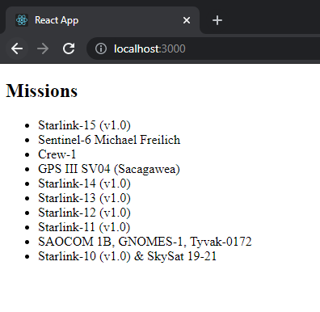

The project will be built with [create-react-app](https://create-react-app.dev/) and use [Apollo Client](https://www.apollographql.com/docs/react/) to manage GraphQL. We will start with a simple simple component that retrieves data from https://api.spacex.land/graphql/.

> To get started with a project using React and Apollo client, follow this [guide](https://www.apollographql.com/docs/react/get-started/).

I have created a component called Missions that retrieves and prints the 10 latest mission names, below is a picture of what it looks like when rendered in the browser. You can find the front-end project [here](https://github.com/loremipsumdonec/optimizely-cms-models/tree/master/posts/ssr_with_react_and_graphql/example/spacex_react).



## Update the render method

For Apollo Client to work correctly on the server side, we will need to set some settings and also extract the state and save it in the HTML document so the application can rehydrate in the browser.

> You can find more information on how to enable server-side rendering for Apollo Client [here](https://www.apollographql.com/docs/react/performance/server-side-rendering/) 

```javascript
export const render = async (entrypoints) => {
	
	const applicationContent = await renderToStringWithData(React.createElement(App));
	const initialApolloClientState = client.extract();

	var files = [];

	const html = ` 
		<html>
			<head>
				${files.join('\n')}
			</head>
			<body>
				${applicationContent}
				<script>
					window.__APOLLO_STATE=${JSON.stringify(initialApolloClientState).replace(/</g, '\\u003c')}
				</script>
			</body>
		</html>`

    ....
}
```

## Communication

By default, when setting up Apollo Client it uses `fetch` . When rendering the application on the server we don't have access to `fetch`, so we need to customize Apollo Client´s data flow and we can do this with [links](https://www.apollographql.com/docs/react/api/link/introduction/).

With a new link and a custom service called `Connector` that we add with `AddHostObject` we can make it possible to send requests to the backend when server-side rendering. I will show more of this service in the next chapter.

```javascript
const directCommunicationWithBackend = new ApolloLink((operation, _) => {

	const { operationName, variables, query } = operation;
  
	let body = {
	  operationName,
	  variables,
	  query: print(query)
	}
  
	return new Observable(observer => {

		// eslint-disable-next-line no-undef
		Connector.Execute('https://api.spacex.land/graphql', JSON.stringify(body))
			.then(response => { 
				operation.setContext({response});	

				var result = JSON.parse(response);
				
				observer.next(result);
				observer.complete();
				
				return result;
			});
		});
});
```

When working with links the graphql query will be in AST format and convert it to a string we need to use the [print](https://graphql.org/graphql-js/language/#print) function that comes with [graphql](graphql/language) package.

## Conclusion

This in itself does not have much to do with Optimizly CMS, but we start with some basics before we introduce GraphQL support for Optimizly CMS. In the next chapter, we will focus on connecting this project with the backend.
