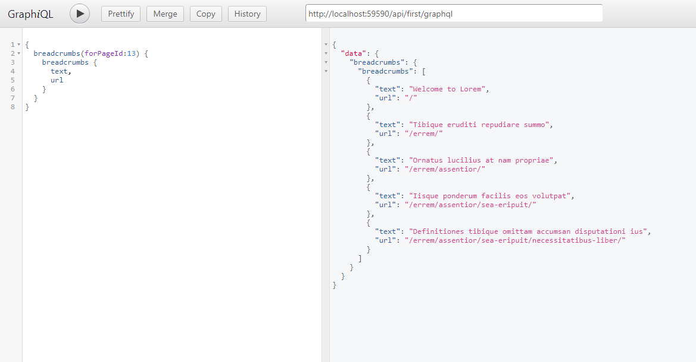
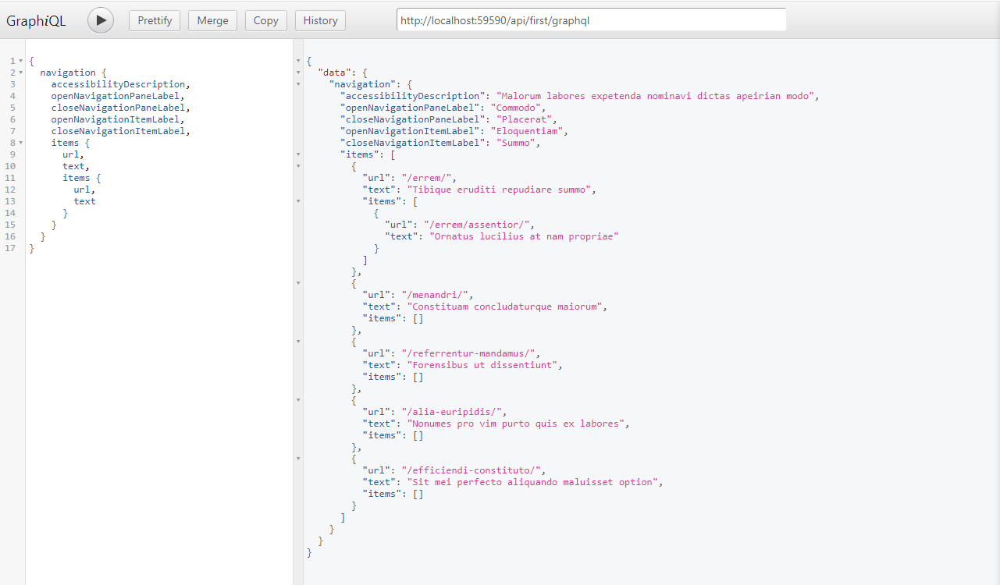

In this example, the choice is to use [GraphQL.NET](https://graphql-dotnet.github.io/), if you are doing this with Optimizely CMS 12 you can also use [HotChocolate](https://github.com/ChilliCream/hotchocolate/). 

We will use GraphQL.NET together with WebApi that will be responsible for exposing an endpoint to GraphQL. It should be sufficient to install [GraphQL](https://www.nuget.org/packages/GraphQL/) and [GraphQL.NewtonsoftJson](https://www.nuget.org/packages/GraphQL.NewtonsoftJson/). In addition to this, we also add support WebApi and make it possible to use dependency injection for these controllers, see feature WebApi for example.

There are also some services for GraphQL.NET that are good to register for dependency injection and that is `DocumentExecuter` and `DocumentWriter`, see GraphQLInitialization.cs.

> Check that WebApi works by creating a simple controller that uses dependency injection.

## Create a schema

Everything that should be exposed with GraphQL needs to be defined as types and then registered in a schema. Which means that for every model that we are going to expose need a new class that defines the fields.

I will build extra classes for each type, so there will be significantly more code but this will make it is easier to show how it works.

> When I normally use GraphQL.NET I use a custom implementation that makes it possible to register various services such as `Register<GetBreadcrumbs, BreadcrumbsModel>()` and then all models are built or use what already exists.

### Breadcrumbs

A first feature that can be good to start with is support for breadcrumbs. For this we will need a service and two models. If you look at the files BreadcrumbsService.cs, BreadcrumbsModel.cs, Breadcrumb.cs, you can see the current implementation. The next step is to create the GraphQL types for the models and below you will see how these could be set up.

```csharp
public class BreadcrumbType
    : ObjectGraphType<Breadcrumb>
{
    public BreadcrumbType()
    {
   		Field(m => m.Text);
        Field(m => m.Url);
    }
}
```

```csharp
public class BreadcrumbsModelType 
    : ObjectGraphType<BreadcrumbsModel>
{
	public BreadcrumbsModelType()
	{
    	Field(m => m.Name);
    	Field<ListGraphType<BreadcrumbType>>(
        	"breadcrumbs", 
                resolve: context => context.Source.Breadcrumbs
            );
    }
}
```

Before these become available via GraphQL, we need to add two more classes, one class that will be responsible for all queries and then schema. These classes should also be registered for dependency injection.

```csharp
public class FirstIterationQuery
    : ObjectGraphType<object>
    {
        public FirstIterationQuery()
        {
            Field<BreadcrumbsModelType>(
                "breadcrumbs",
                arguments: new QueryArguments(
                    new QueryArgument<NonNullGraphType<IntGraphType>> { Name = "forPageId" }
                ),
                resolve: context =>
                {
                    int forPageId = (int)context.Arguments["forPageId"].Value;
                    var forPage = new ContentReference(forPageId);

                    var service = ServiceLocator.Current.GetInstance<BreadcrumbsService>();
                    return service.GetBreadcrumbs(forPage);
                }
            );
        }
    }
```

```csharp
public class FirstIterationSchema
    : Schema
    {
        public FirstIterationSchema(FirstIterationQuery query)
        {
            Query = query;
        }
    }
```

The final step is then to create an endpoint, see FirstIterationApiController.cs for example. If you then visit the endpoint with GraphiQL, you should be able to use it.



### Navigation

Another common feature is navigation, and it's usually built in a tree structure.

```csharp
public class NavigationItem
{
    public NavigationItem()
    {
        Items = new List<NavigationItem>();
    }

    public string Url { get; set; }

    public string Text { get; set; }

    public List<NavigationItem> Items {get; set;}
}
```

One of the advantages of GraphQL is that the front-end determines what information to get, and in this case, it could also include the number of levels in the navigation.

If we add support to the model for lazy loading, the backend does not have to decide how many levels to retrieve, it is more up to the front-end to define it in the query.

```csharp
public class NavigationItem
{
    private readonly Lazy<IEnumerable<NavigationItem>> _loadItems;
    private List<NavigationItem> _items = new List<NavigationItem>();

    public NavigationItem()
    {
    }

    public NavigationItem(Func<IEnumerable<NavigationItem>> loadItems)
    {
        _loadItems = new Lazy<IEnumerable<NavigationItem>>(loadItems);
    }

    public string Url { get; set; }

    public string Text { get; set; }

    public List<NavigationItem> Items 
    { 
        get 
        {
            if(_loadItems != null 
               && !_loadItems.IsValueCreated)
            {
                foreach(var item in _loadItems.Value) 
                {
                    Add(item);
                }
            }

            return _items;
        }
        set
        {
            _items = value;
        }
    }

    public void Add(NavigationItem item) 
    {
        _items.Add(item);
    }
}
```

It is important to think about accessibility and usually some texts are needed so that the component meet the accessibility requirements. We can add these fields on the NavigationModel, this model should also implement lazy loading for the items. 

```csharp
    public class NavigationModel 
    {
        ...

        public string AccessibilityDescription { get; set; }

        public string OpenNavigationPaneLabel { get; set; }

        public string CloseNavigationPaneLabel { get; set; }

        public string OpenNavigationItemLabel { get; set; }

        public string CloseNavigationItemLabel { get; set; }

        public List<NavigationItem> Items
        {
            ....
        }
        
        ...
    }
```

The next step is the same as with breadcrumbs and that is to add the types and create the query.

```csharp
public class NavigationItemType
    : ObjectGraphType<NavigationItem>
{
    public NavigationItemType()
    {
        Field(m => m.Url);
        Field(m => m.Text);

        Field<ListGraphType<NavigationItemType>>(
            "items",
            resolve: context => context.Source.Items
        );
    }
}
```

```csharp
public class NavigationModelType
    : ObjectGraphType<NavigationModel>
{
    public NavigationModelType()
    {
        Field(m => m.AccessibilityDescription);
        Field(m => m.OpenNavigationPaneLabel);
        Field(m => m.CloseNavigationPaneLabel);
        Field(m => m.OpenNavigationItemLabel);
        Field(m => m.CloseNavigationItemLabel);

        Field<ListGraphType<NavigationItemType>>(
            "items",
            resolve: context => context.Source.Items
        );
    }
}
```

```csharp
public class FirstIterationQuery
    : ObjectGraphType<object>
{
    public FirstIterationQuery()
    {
		...
        
        Field<NavigationModelType>(
            "navigation",
            arguments: new QueryArguments(
                new QueryArgument<IntGraphType> { Name = "fromPageId" }
            ),
            resolve: context =>
            {
                ContentReference fromPage = ContentReference.StartPage;

                if (context.Arguments.ContainsKey("fromPageId")
                    && context.Arguments["fromPageId"].Value != null)
                {
                    fromPage = new ContentReference((int)context.Arguments["fromPageId"].Value);
                }

                var service = ServiceLocator.Current.GetInstance<NavigationService>();
                return service.GetNavigation(fromPage);
            }
        );
    }
}
```

You can find the complete implementation here and if we use navigation, it is possible to control how many levels to retrieve.



## Conclusion

Now we have added support for GraphQL in a Optimizely CMS implementation, this will make it easier for both backend and frontend to build functions.
